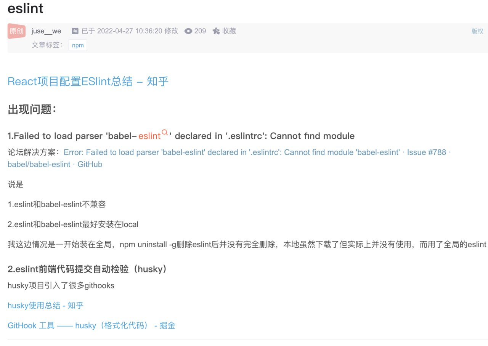

Error: Failed to load parser 'babel-eslint' declared in '.eslintrc': Cannot find module 'babel-eslint' #788
 
解决办法:
yarn add babel-eslint -D

相关链接： https://github.com/babel/babel-eslint/issues/788

https://blog.csdn.net/juse__we/article/details/120206638
