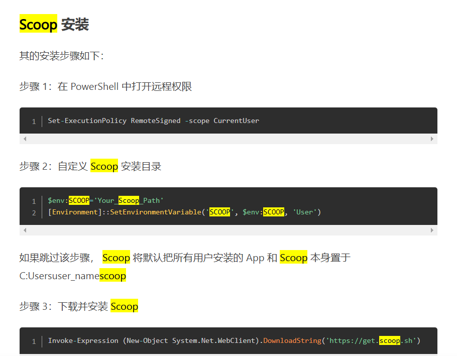
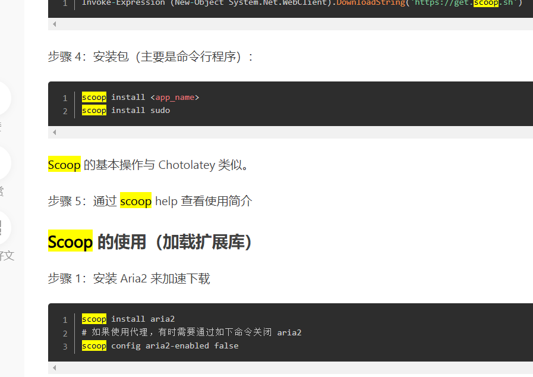

步骤 1：在 PowerShell 中打开远程权限

Set-ExecutionPolicy RemoteSigned -scope CurrentUser

步骤 2：自定义 Scoop 安装目录
$env:SCOOP='Your_Scoop_Path'
[Environment]::SetEnvironmentVariable('SCOOP', $env:SCOOP, 'User')

步骤 3：下载并安装 Scoop
Invoke-Expression (New-Object System.Net.WebClient).DownloadString('https://get.scoop.sh')

步骤 4：安装包（主要是命令行程序）：
scoop install <app_name>
scoop install sudo

